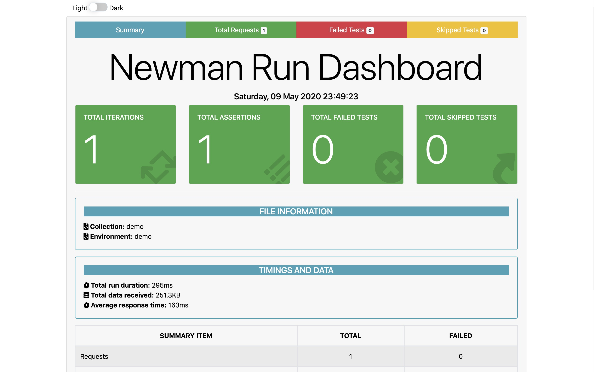
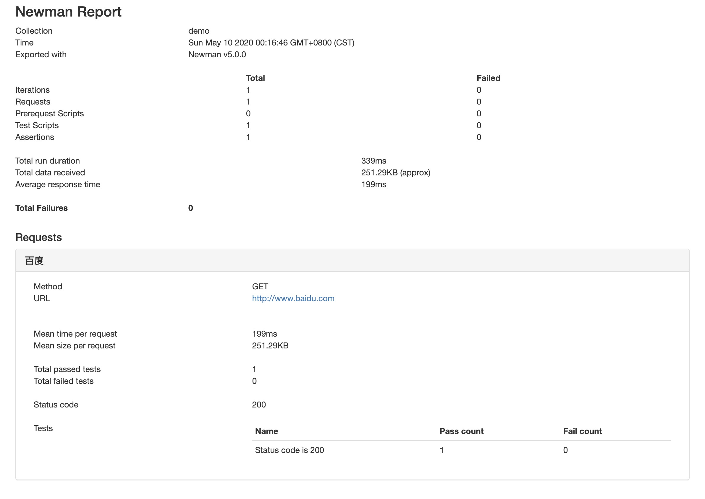
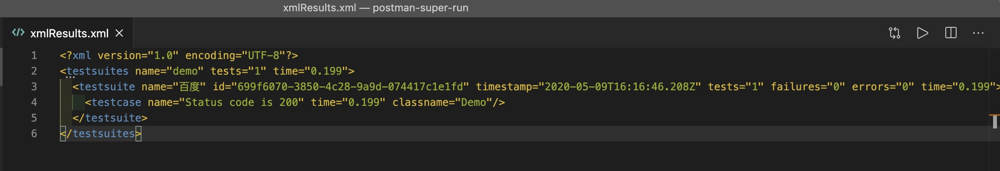
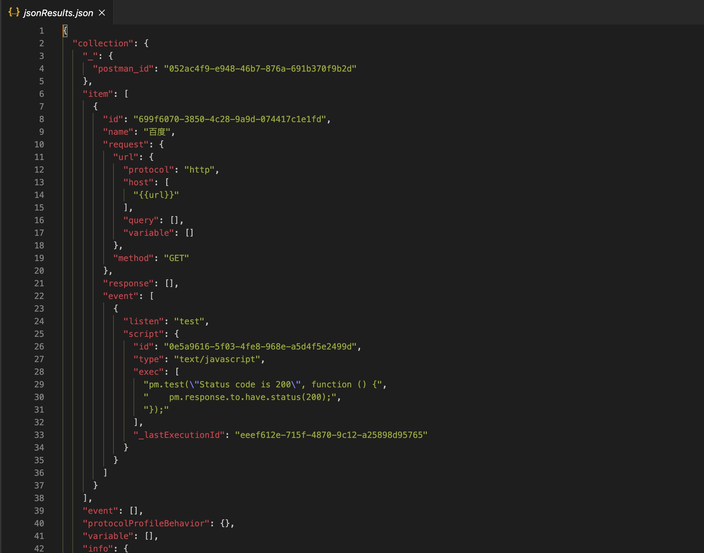
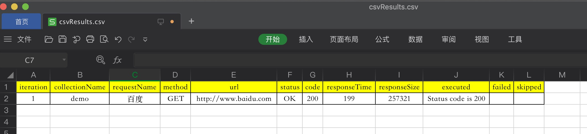
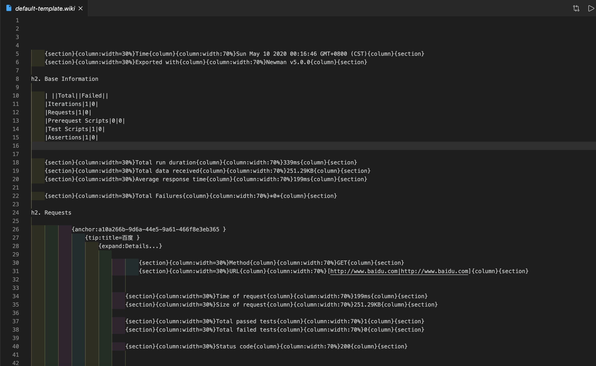
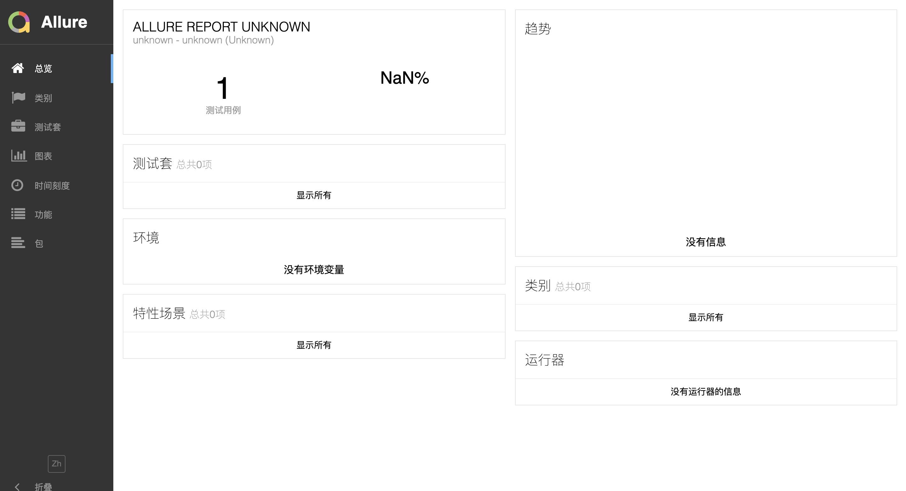
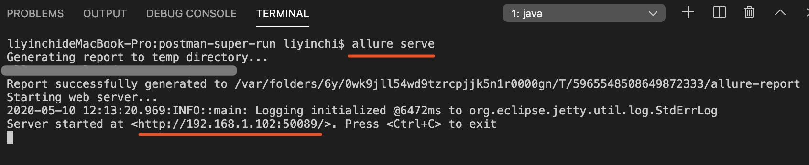
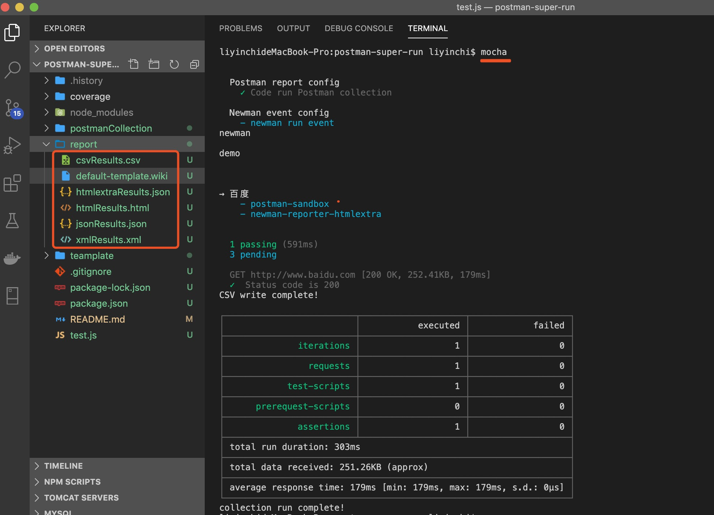

# Postman-super-run-debug

# 1.功能

* 让 Postman 多种报告格式文件
* 不打开 Postman 客户端软件，也能运行 Postman 脚本（collection.json）

## 2.自动生成 Postman 多种格式报告文件

>报告文件位置 在eport文件夹下

报告 | 格式 | 
:-: | :-: | 
default html | html | 
htmlextra | html | 
junit  | xml | 
json| json | 
csv | csv | 
confluence wiki | wiki | 
allure | html | 
testrail | api | 
statsd | api | 
teamcity | api | 
influxdb   | api | 

### （1）htmlextraResults.html

### （2）htmlResults.html

### （3）junit xmlResults.xml

### （4）jsonResults.json

### （5）csvResults.csv

### （6）default-template.wiki

### （7）allureResults.html

```
allure serve
```


### （8）statsd
### （9）teamcity
### （10）influxdb

## 2.使用

打开命令行窗口，输入

### （1）Nodejs

  | 版本 |
 |------------- |
| >8.17.0 |

>如果你电脑还未安装配置nodejs环境，请参考：https://www.runoob.com/nodejs/nodejs-install-setup.html

如果已安装配置nodejs，可跳过此步骤

### （2）安装
```shell
npm install
```

### （3）运行

```shell
mocha 
```



## 3.目录
文件夹 | 描述 | 
:-: | :-: | 
postmanCollection | 存放示例Postman json collection脚本 | 
report | 报告文件生成位置 | 
teamplate | 报告模板，可在github上面查找各种postman关于hbs报告模板| 


## 4.Newman 触发事件

>Newman 是 Postman团队（谷歌）开源的工具，用于执行Postman脚本（可以理解为运行环境）

事件 | 描述 | 
:-: | :-: | 
start | 集合运行的开始 | 
start | 集合运行的开始| 
beforeIteration | 在迭代开始之前| 
beforeItem | 在项目执行开始之前（prerequest-> request-> test的集合）| 
beforePrerequest | 在prerequest脚本开始执行之前| 
prerequest | 后prerequest脚本执行完成| 
beforeRequest | 发送HTTP请求之前| 
request | 收到请求响应后| 
beforeTest | 在test脚本开始执行之前| 
test | 后test脚本执行完成| 
beforeScript	| 在执行任何脚本（类型test或prerequest）之前| 
script | 执行任何脚本（类型为test或prerequest）后| 
item | 一个项目（整套prerequest-> request-> test）完成时| 
iteration | 迭代完成后| 
assertion | test脚本中完成的每个测试断言都会触发此事件| 
console | 每次console从任何脚本中调用函数时，都会传播此事件| 
exception | 当在scripts此事件中发生任何异步错误时，将触发| 
beforeDone | 运行完成之前触发的事件| 
done | 收集运行完成（有无错误）时，将发出此事件| 


## 5. Postman-super-run 编写时所用的工具

Postman 7.23.0

Newman  5.0 

htmlextra - This is an updated version of the standard HTML reporter containing a more in-depth data output and a few helpful extras

csv - This reporter creates a csv file containing the high level summary of the Collection run

json-summary - A Newman JSON Reporter that strips the results down to a minimum

teamcity - A reporter built to be used with the Team City CI server

testrail - A reporter built for Test Rail, the test case management tool

statsd - This reporter can be used to send the Collection run data to statsd and used on time series analytic tools like Grafana

confluence - Confluence reporter for Newman that uploads a Newman report on a Confluence page

influxdb - This reporter sends the test results information to InfluxDB which can be used from Grafana to build dashboards
